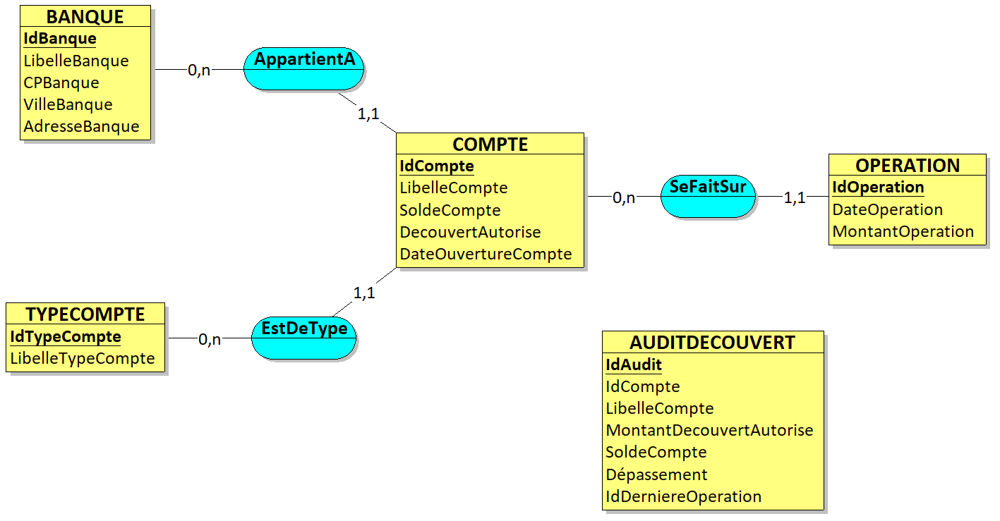

# BDD-AppBank

IUT Paris Descartes - 2020 - Enseignant : FESSY Jérôme.

## Développement en PL/SQL d'une application bancaire de gestion de comptes. 

Dans le cadre du cours de Base de Données, Jérôme Fessy a proposé de développer une application pour la *gestion de de comptes*. 

## Auteur
 
JALLAIS Adrien : adrien.jallais@protonmail.com  

## Description

Ce projet porte sur la mise en exploitation de la partie serveur d’une application de gestion de comptes bancaires. Une IHM cliente de gestion de compte a été développée par une entreprise prestataire (hors cadre du projet). Ce travail consiste à mettre en place tous les composants du serveur ORACLE (les tables, les Packages et les vues) pour que cette IHM cliente puisse interagir avec la base de données.

Le modèle conceptuel implanté est le suivant :

Cette application contient :

+ Les tables de production qui contiennent toutes les données bancaires des clients
    + [implémentation](./Requêtes/Requêtes-séparées/LOT1_APPLI_Jallais_Adrien.sql) 
+ Le package qui contient des procédures et fonctions stockées appelables par l’IHM cliente pour réaliser des actions sur les tables de productions.
    + [implémentation](./Requêtes/Requêtes-séparées/LOT2_APPLI_Jallais_Adrien.sql) 
    + [test](./Requêtes/Requêtes-test/LOT2_APPLI_Jallais_Adrien-test.sql) 
+ Un trigger permettant la réalisation d'un audit sur le découvert de compte les IHM clientes.
    + [implémentation](./Requêtes/Requêtes-séparées/LOT3_APPLI_Jallais_Adrien.sql) 
    + [test](./Requêtes/Requêtes-test/LOT3_APPLI_Jallais_Adrien-test.sql) 
+ Les vues qui sont les pseudo-tables consultables par les IHM clientes. Elles permettent de cibler les informations utiles.
    + [implémentation](./Requêtes/Requêtes-séparées/LOT4_APPLI_Jallais_Adrien.sql) 
    + [test](./Requêtes/Requêtes-test/LOT4_APPLI_Jallais_Adrien-test.sql)
    
Le script complet de l'ensemble des requêtes est disponible dans le fichier suivant : [LOT 1 2 3 et 4](./Requêtes/LOT1234_APPLI_Jallais_Adrien.sql)
